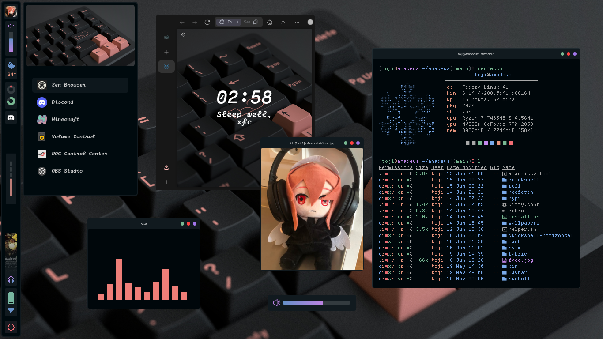
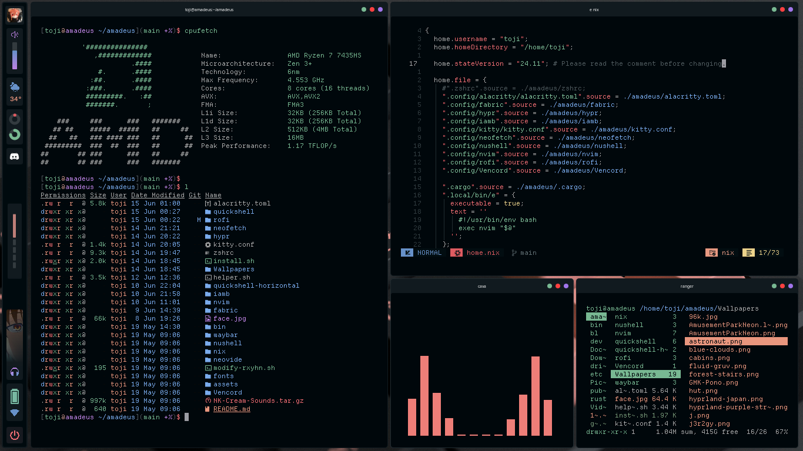
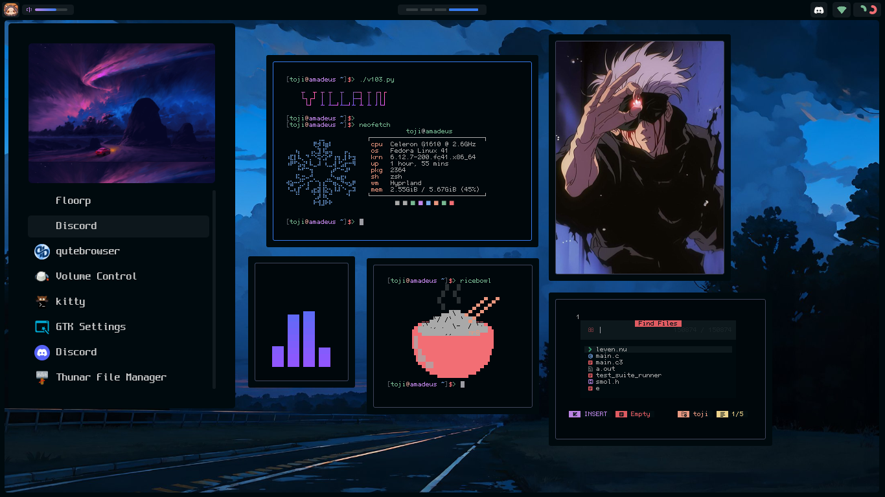

         
        
        
        
          
        <h4 align="center"> my personal desktop made with hyprland and quickshell </h4>

    
    

    
 Older themes available in git history (click to expand) 

    

        
        
        
        
        
        
    

