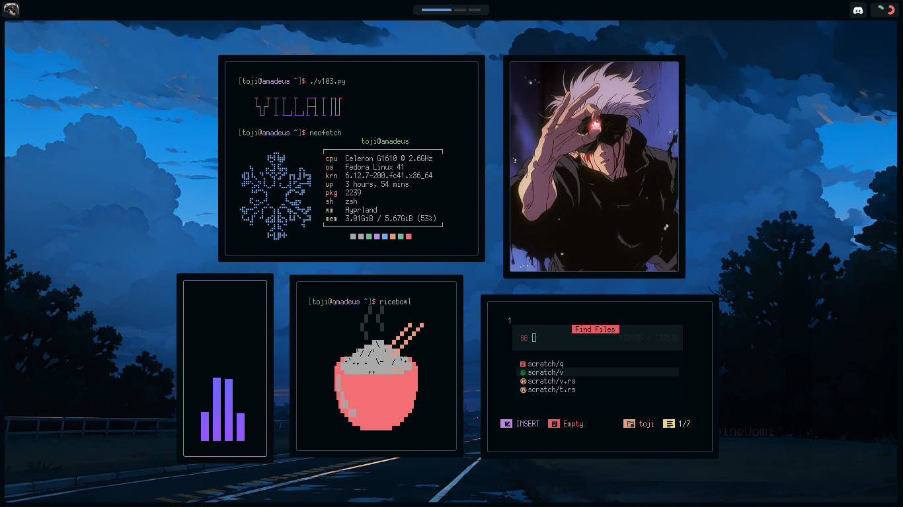

    <h1 align="center"> ❄️ Dotfiles </h1>

    <h4 align="center"> my configuration files for hyprland, neovim, and some other applications </h4>
    

    

## Older themes available in git history:

    
    
    
    

